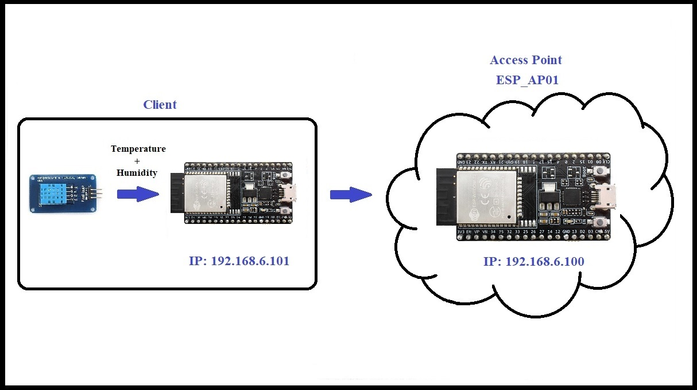

# ESP32-WiFi-TempSensor-Network

This project implements a WiFi-based temperature and humidity monitoring network using ESP32 microcontrollers. It consists of an ESP32 Access Point (AP) that receives data from one or more ESP32 Stations (STA). The stations collect environmental data using DHT11 sensors and transmit it to the AP using UDP protocol.




## Features

- ESP32 Access Point creation
- WiFi communication using UDP
- Temperature and humidity monitoring using DHT11 sensor
- Multiple station support
- RSSI (Received Signal Strength Indicator) reporting
- Static IP configuration

## Hardware Requirements

- At least 2 ESP32 development boards (1 for AP, 1+ for STA)
- DHT11 temperature and humidity sensor(s) (one per STA)
- Appropriate power supply for each ESP32

## Software Dependencies

- Arduino IDE
- ESP32 board support for Arduino
- WiFi library (built-in with ESP32 board support)
- WiFiUdp library (built-in with ESP32 board support)
- DHT sensor library

## Installation

1. Install the Arduino IDE and ESP32 board support.
2. Install the required DHT sensor library.
3. Clone this repository or download the source code.
4. Open the `.ino` files in Arduino IDE.

## Configuration

### Access Point (AP) Configuration

```cpp
const char *ssid = "ESP_AP01";
const char *password = "ESP123456789";
IPAddress localDevIP(192, 168, 6, 100);
IPAddress gateway(192, 168, 6, 1);
IPAddress subnet(255, 255, 255, 0);
unsigned int localUdpPort = 61500;
```

### Station (STA) Configuration

```cpp
const char* ssid = "ESP_AP01";
const char* password = "ESP123456789";
int numNode = 1;
float numPeriod = 10000;
IPAddress localDevIP(192, 168, 6, 101);
IPAddress remoteDevIP(192, 168, 6, 100);
IPAddress gateway(192, 168, 6, 1);
IPAddress subnet(255, 255, 255, 0);
unsigned int localUdpPort = 61501;
unsigned int remoteUdpPort = 61500;
```


Ensure that the SSID and password match between AP and STA. Adjust IP addresses and UDP ports as needed.

## Usage

1. Upload the AP code to one ESP32.
2. Upload the STA code to one or more other ESP32s.
3. Power on all devices.
4. The AP will create a WiFi network, and the STAs will connect to it.
5. STAs will send temperature and humidity data to the AP at regular intervals.
6. Monitor the Serial output on both AP and STAs for debugging information.

## Data Format

The STA sends data to the AP in the following format:

```
n=1&Counter=1&Temperature=25.50&Humidity=60.00
```


## Network Structure

- The AP creates a WiFi network with the configured SSID and password.<a href="https://nowpayments.io/donation?api_key=REWCYVC-A1AMFK3-QNRS663-PKJSBD2&source=lk_donation&medium=referral" target="_blank">
     
    </a>
- Each STA connects to this network with a unique IP address.
- STAs send UDP packets to the AP's IP address and port.
- The AP receives these packets and can process or forward the data as needed.

## Contributing

Contributions to improve the project are welcome. Please feel free to submit a Pull Request.

## License

This project is open-source and available under the [MIT License](LICENSE).

<a href="https://nowpayments.io/donation?api_key=REWCYVC-A1AMFK3-QNRS663-PKJSBD2&source=lk_donation&medium=referral" target="_blank">
  
</a>
